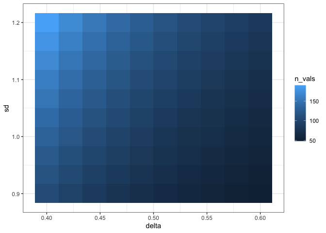

<!-- README.md is generated from README.Rmd. Please edit that file -->

# hw4

<!-- badges: start -->

[](https://github.com/jh-adv-data-sci/project-4-r-packages-sarahunsberger1/actions/workflows/R-CMD-check.yaml)

[](https://app.codecov.io/gh/jh-adv-data-sci/project-4-r-packages-sarahunsberger1)
<!-- badges: end -->

The goal of hw4 is to have functions that allow a user to plan an
Alzheimer’s treatment study. The package includes functions to calculate
sample size, budget and an option for visualization of sample size.

## Installation

You can install the development version of hw4 from
[GitHub](https://github.com/jh-adv-data-sci/project-4-r-packages-sarahunsberger1).

You can use the following code to install it:

``` r
if (!require("devtools", quietly = TRUE)) {
    install.packages("devtools")   
}

library(devtools)

devtools::install_github("jh-adv-data-sci/project-4-r-packages-sarahunsberger1", build_vignettes = TRUE)
```

## Example

Here is an example sample size calculation using the sample_size_calc()
function:

``` r
library(hw4)
ss <- sample_size_calc(delta = 0.6, sd = 1.5, sig.level = 0.05, power = 0.9, alternative = 'two.sided', bonferonni = FALSE)

ss
#> 
#>      Two-sample t test power calculation 
#> 
#>               n = 132.3106
#>           delta = 0.6
#>              sd = 1.5
#>       sig.level = 0.05
#>           power = 0.9
#>     alternative = two.sided
#> 
#> NOTE: n is number in *each* group
```

The user would then use the specified sample size to caculate the budget
needed for their study with the budget_calc() function:

``` r
budget_calc(n_primary = round(ss$n), n_secondary = 0, n_followup_primary = 1, n_followup_secondary = 1)
#> [1] 1320000
```

The user may want to see how different values of delta and sd affect the
calculated sample size so they can use the function plot_n():

``` r
plot_n(power = 0.8, delta_start = 0.4, delta_end = 0.6, sd_start = 0.9, sd_end = 1.2, length_vec = 10)
```


